<div align="center">

[](https://sensus.sh)

A fullscreen TUI that hosts a real, interactive shell in a large left pane with an AI
agent chat sidebar on the right. The agent sees your terminal, investigates in a hidden
shell, and can type into your visible pane on request.

[](https://sensus.sh/docs/install/)
[](https://sensus.sh/docs/development/)
[](https://sensus.sh/docs/)
<a href="https://sensus.sh" target="_blank" rel="noopener"></a>

</div>

---



<details>
<summary><strong>Topbar layout</strong></summary>



</details>

<div align="center">

**Install (Linux & macOS):**

```sh
curl -fsSL https://sensus.sh/install | bash
```

[All install options ↓](#install)

</div>

## Why Sensus?

Sensus puts the agent *inside* the terminal you already use:

- **A real shell.** The left pane is one native PTY per tab, rendered by OpenTUI's embedded
  Ghostty VT. `vim`, `htop`, colors, mouse, and scrollback behave like a real terminal.
- **The agent sees your terminal.** cwd, shell, recent output, and git status are context.
  It investigates in a hidden shell without touching your screen, and can type into your
  visible pane on request.
- **Approvals by default.** Every read, command, write, and MCP call shows an inline card
  (`y`/`n`/`a`) unless you saved an allow rule. The agent can type into your pane, but
  Enter is always confirmed.
- **Your model, your endpoint.** OpenAI-compatible (the default), OpenAI Responses,
  Anthropic, or Google Gemini. Your config, sessions, and memory stay on your machine.
- **It remembers.** Plain-markdown memory and on-demand skills, plus searchable session
  transcripts that survive restarts.

## The 60-second tour

- The left pane is your shell; type in it as usual. `Shift+Tab` moves focus to the chat.
- Ask the agent for something and answer the approval cards with `y` / `n` / `a`.
- The agent works in a **hidden** shell by default. Say "run it in my terminal" (or use
  the built-in *copilot* agent) and it types into the visible pane instead.
- `Ctrl+T` opens another tab (another shell and another chat). `Ctrl+W` closes it.
- Quitting (or `Ctrl+A d`) detaches: the local daemon keeps your shells and any running
  agent turn alive, ready to re-attach on the next boot. `sensus kill` is the kill switch.

## Install

```sh
curl -fsSL https://sensus.sh/install | bash
sensus   # first run opens the guided setup inside sensus
```

The installer detects your platform, verifies checksums, installs to `~/.local/bin`,
warns if that is not on your `PATH`, and scaffolds a starter config without overwriting
an existing one. It is safe to re-run. Sensus needs Linux or macOS on x86_64/aarch64 and
works over SSH; Bun is only needed to build from source.

System-wide (`-g`), pinned releases, updates, and building from source:
[Install](https://sensus.sh/docs/install/) and
[Build from source](https://sensus.sh/docs/development/).

## Documentation

The manual lives at **[sensus.sh/docs](https://sensus.sh/docs/)**.

- **Work with the agent:** [How the agent works](https://sensus.sh/docs/how-it-works/) ·
  [Approvals](https://sensus.sh/docs/approvals/) · [Tools](https://sensus.sh/docs/tools/) ·
  [Agents](https://sensus.sh/docs/agents/) · [Skills](https://sensus.sh/docs/skills/) ·
  [Memory](https://sensus.sh/docs/memory/) · [Sessions](https://sensus.sh/docs/sessions/) ·
  [MCP](https://sensus.sh/docs/mcp/) · [Triggers](https://sensus.sh/docs/triggers/)
- **Configure:** [Configuration](https://sensus.sh/docs/configuration/) ·
  [Keybindings](https://sensus.sh/docs/keybindings/) · [CLI](https://sensus.sh/docs/cli/)
- **Help:** [Troubleshooting](https://sensus.sh/docs/troubleshooting/) ·
  [Changelog](https://sensus.sh/docs/changelog/) ·
  [Privacy & data](https://sensus.sh/docs/privacy/) ·
  [License](https://sensus.sh/docs/license/)
- **Contribute:** [Build from source](https://sensus.sh/docs/development/) ·
  [CONTRIBUTING.md](CONTRIBUTING.md) · [engineering docs](docs/README.md)

## Development

```sh
git clone https://github.com/zbejas/sensus.git sensus && cd sensus
bun install
bun run dev          # run from source (interactive)
bun run typecheck    # tsc --noEmit, must pass
bun run test:unit    # unit suite (~15s), the day-to-day loop
bun run test:smoke   # smoke suite, boots the real app in an outer tmux driver
bun test             # full suite, the final gate
bun run build        # standalone binary -> dist/sensus
./scripts/build-install.sh   # build + install (user by default; -g for global)
```

Requires Bun ≥ 1.4.1 to run from source and ≥ 1.4.2 to build the binary. The contributor
knowledge base starts at [`docs/architecture.md`](docs/architecture.md); the manual's
[Build from source](https://sensus.sh/docs/development/) page covers the same ground for
users.

## License

Apache-2.0, in full: no open-core split, no gated features. See [LICENSE](LICENSE) and
[NOTICE](NOTICE).
